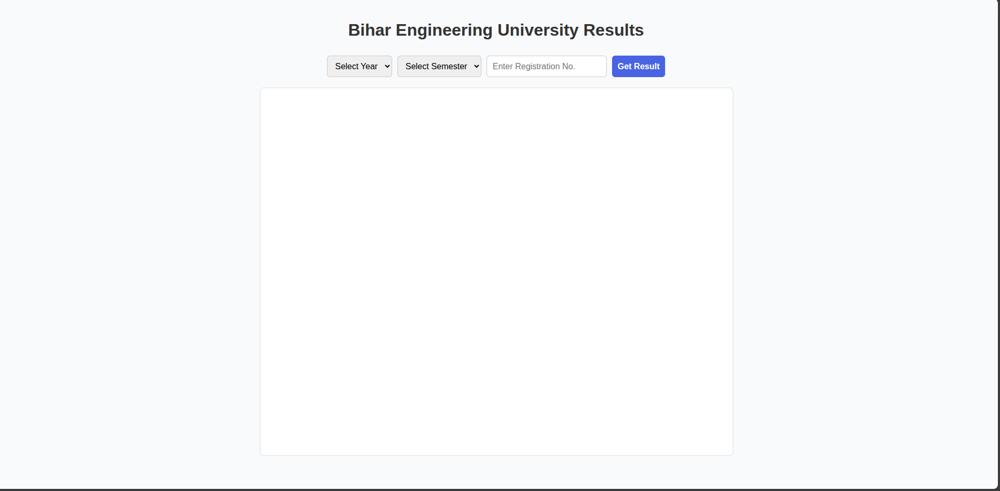

# BEU Results

A simple web app to fetch and display **Bihar Engineering University (BEU)** results using year, semester, and registration number.

---

## 🚀 Features

- Dropdowns for **Year** and **Semester** (auto-generated).
- Enter **Registration Number** to fetch results.
- Loader with spinner while fetching results.
- Timeout fallback if the result page doesn’t load.
- Responsive design for mobile & desktop.

---

## Structure

beu-results/
│── index.html
│── README.md

1. Clone the repository:

   ```bash
   git clone https://github.com/your-username/beu-results.git
   cd beu-results
   ```

2. Open `index.html` in your browser.

3. Select **Year**, **Semester**, enter your **Registration No.**, and click **Get Result**.

---

## Demo Screenshot



---

## License

This project is licensed under the MIT License.
